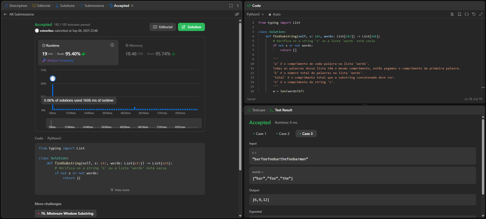

# Trabalho 1 - Algoritmos de Busca

## Alunos  
| Matrícula | Nome |  
|-----------|---------------------|  
| 20/2063201 | Ester Flores Lino da Silva |  
| 20/2042927 | Eduardo Schuindt Santos |

## Descrição do projeto

Para o Trabalho 1 a dupla optou por solucionar questões da plataforma **[LeetCode](https://leetcode.com/)**. Seguindo as orientações do professor Maurício Serrano, resolvemos 4 desafios. Dois do nível difícil e dois do nível médio. Dessa maneira, a dupla busca demonstrar o conhecimento adquirido durante as aulas e estudos sobre o tema Algoritmos de Busca.

Sobre a realização do trabalho, cada exercício contém seu código resposta, screenshots da tela de submissão do **[LeetCode](https://leetcode.com/)** e vídeo de até 5 minutos explicando objetivamente as resoluções propostas.

## Guia de instalação

Utilizamos Python para resolver os desafios. 

## Capturas de tela

### Exercício 01 - Difícil - 30. Substring with Concatenation of All Words

### Exercício 02 - Difícil 

### Exercício 03 - Médio 

### Exercício 04 - Médio 

## Verificação

Para verificar se as resoluções aqui propostas estão corretas e foram aceitas, submeter os códigos no **[LeetCode](https://leetcode.com/)** e conferir se foi aceito ou não. Todo exercício contém o link para descrição do problema no seu próprio código de resolução.
